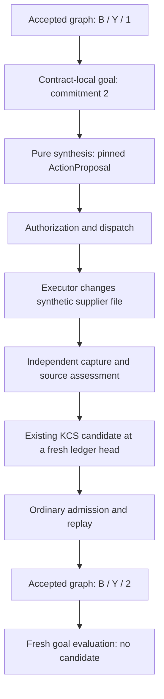

# Semantic Re-entry: the external-action thought experiment

Current integration status, 2026-09-08 UTC: Core's dependency gate has passed
and the supplier E2E is in implementation. The five-minute continuation is
active. Start with [INTEGRATION_STATUS.md](INTEGRATION_STATUS.md) for the exact
workspace, verified dependency and remaining work. The historical scope and
blocked/proposed labels below are not the current execution status.

Current component result: [pure supplier model and source mapper](SUPPLIER_COMPONENT_REVIEW.md)
are implemented and tested. This does not complete or activate the external
action loop. The design and historical baseline below retain their original scope.

Status: PROPOSED design, with executable seam-audit evidence. This is not an
external-action implementation, a new public contract, or a change to the frozen
internal-correction result. Audit base: `63a05659a826317f5afee8cfc5544042fc302284`,
tree `2b5f9cb7ed803a68f2536fcbc83c3959cf6257b4`.

## The smallest useful question

Can a goal concerning supplier order B cause a proposed action, and can the
accepted graph change only after an independent observation supplies new
evidence through ordinary KCS admission?

Proposed first goal: **the supplier file records a commitment of two units of Y
on B**. This is not a claim that two units were delivered, are available, satisfy
a customer order, or will arrive on time. Those uses need more information and
separate requirements. The distinction is part of the experiment, not fine print.

Claim: within one explicit optional action/history profile, a pure synthesizer
proposes an authorized amendment without graph-writing authority; a separate
executor changes a synthetic domain file; an independent observer captures it;
an observed-source adapter proposes the existing KCS; admission and replay
revise accepted state; rerunning the satisfied goal produces nothing.

Observation: before accepted observation-derived correction, the graph still
says B/Y/1 even after a successful execution receipt. After admission it says
B/Y/2, preserves the complement and history, and produces no further action.

Reuse: canonical B/Y/e4, the compiler's KCS, retained-byte and population seams,
the existing ActionProposal family and effect-lifecycle semantics, and the
landed consumer's pinning/preservation/refusal requirements.

Exclusions: production supplier integration, actual customer demand claims,
paid/network calls, source truth, automatic semantic repair, general planning,
exactly-once delivery, global Assent replacement, policy legitimacy, package
promotion, paper edits, and any change to the locked Shop evidence.

## See the intended loop

Every protocol transition belongs to one authoritative history. Only accepted
KCS application changes the accepted domain graph. The supplier file is an
external domain being acted upon, not a second authority for accepted KG state.
The diagram is the proposed composition; the action-to-KCS single-ledger join
is not supplied by the currently inspected default profile.

| Moment | Supplier file in the proposed simulation | Accepted graph | What can be claimed |
| :--- | :--- | :--- | :--- |
| Initial capture admitted | B/Y/1 | B/Y/1 | Initial representation passed its declared checks. |
| Goal and action proposed | B/Y/1 | B/Y/1 | A permitted amendment was proposed. |
| Authorized and dispatched | B/Y/1 | B/Y/1 | Dispatch is permitted under the selected policy. |
| Executor reports completion | May be B/Y/2 | B/Y/1 | The executor reported a result, not an observed fact. |
| Observer captures new bytes | Captured B/Y/2 | B/Y/1 | The observation reports those bytes under its contract. |
| KCS proposed and checked | Captured B/Y/2 | B/Y/1 | A correction is a candidate, not yet accepted. |
| KCS admitted and replayed | Captured B/Y/2 | B/Y/2 | Accepted representation changed under the selected checks. |
| Goal reevaluated | No new effect | B/Y/2 | This narrow goal is satisfied at this bound state. |

## Exact mapping to the accepted Shop

The correction fixture retains two rows in one source artifact:
`e4: B/Y/1` and `e7: B/Y/2`. Its explicit mapping declares e7 supersedes e4.
Its attribution expressly excludes `DEMAND_OR_SUPPLY_GAP` and `ACTION_OR_EFFECT`.
See `fixtures/small_shop_fulfilment_correction_v1/input/attribution.json` under
`research/ontology_driven_kg_realization`.

The old Re-entry fixture has already retained both rows when its accepted graph
still contains only e4. It is therefore invalid to replay that fixture and call
the pre-existing e7 row a newly observed consequence of a simulated action.

Proposed new sibling scenario, subject to approval:

1. Reuse the canonical e4 values and record `supplier-order-state:B:e4` as the
   initial accepted commitment, with RET-010 as the preservation complement.
2. Supply target quantity two as an explicit, identified scenario goal. It is
   not an invented accepted demand fact. A derived SupplyGapFinding remains
   contract-local, and means only the shortfall under the declared eligibility
   scope. Missing or ineligible supply must not silently become zero.
3. Use an independently identified synthetic external snapshot containing only
   the initial state. Retain the attribution and selection that distinguish it
   from the canonical two-row source. No canonical source bytes are edited.
4. Let the executor produce a distinct synthetic occurrence and snapshot. Do
   not reuse e7's source identity, timestamps or attribution as causal evidence.
   Concrete synthetic IDs belong in the approved fixture, not in Core.
5. Derive a new supplier-state record from that capture and explicitly supersede
   the initial record. e7 remains a comparator for the quantity-two meaning,
   not evidence that this action ran. No date is inferred from e4/e7.

If the required demonstration is instead about actual demand satisfaction,
this cut is insufficient. An approved demand source, eligibility rules, time
scope and task-coverage oracle are then separate prerequisites.

## Re-entry at each level

| Level | Boundary and proposed obligation |
| :--- | :--- |
| Protocol bytes | Canonical contract/action artifacts parse to the same values. This is serialization, not semantic inversion. |
| Source interpretation | Exact captured bytes, selected fields, units, IDs and explicit correction mapping support the proposed representation. A locator alone is insufficient. |
| Accepted graph to finding | Query the bound state and declared eligible commitments. The finding is derived, not independent KG authority. |
| Goal to candidate | Use GoalPredicate semantics, not writable-view inversion. Return candidates, a genuine no-op or declared refusal. |
| Action model | Model-check preconditions, target quantity and preservation. Simulation describes the model, never an observed world change. |
| Authorization and effect | The action crosses an explicit policy and dispatch boundary; only the executor has domain-writing authority. |
| Observation to knowledge | Capture independently; validate source agreement; compose the existing KCS against current accepted state; admit normally. |
| Replay and intended use | Replay reconstructs the recorded result. Source faithfulness and adequacy for this narrow use each need their own observations. |

The Re-entry Rule applies throughout: a derived result may affect accepted
knowledge or the external domain only through the corresponding proposal path.
No proposed source mapper, goal evaluator or synthesizer receives the history
writer or a mutable accepted graph.

## Proposed contract choices, not new public vocabulary

The immutable, addressable Re-entry Contract binds the original ledger
head/count, accepted-state identity, effective contract and projection; the
goal and its source/authority; permitted ActionProposal type and operator
grammar; preservation/evidence requirements; exact synthesizer and action-model
identities; ambiguity behavior; budget; stopping rule; and refusal behavior.

For the proposed first proof, permit only one operation: set B's commitment
from one to two, for Y, conditional on the selected pre-state snapshot. No
implicit option to add another order, switch suppliers, lower the goal, omit
a field, or remove a relation. Competing eligible matches refuse rather than
being ranked by enumeration order. Other strategies require another explicit
contract, not a fallback.

Proposed limits: at most one candidate and one dispatch attempt; no automatic
retry. Before satisfaction, an already pending action must be reported as
pending or refused under the declared rule, not redispatched or called
satisfied. A zero-candidate result must distinguish satisfied from pending or
refusal. Do not add a generic queue or scheduler to demonstrate this.

The executor checks the declared external precondition immediately before its
controlled write. For the first simulation, select one writer and a bounded
file-update mechanism. Do not translate that into distributed concurrency or
exactly-once delivery claims.

### There are different state pins

The proposal keeps its original accepted-state pin permanently. Appending that
proposal, its authorization and its receipt necessarily advances the protocol
ledger. Comparing every later event with the original ledger head would reject
the lifecycle's own progress. Silently replacing the old pin would erase what
the synthesizer saw.

Core must define which current coordinates each transition checks: the exact
action, authorization and current accepted context for dispatch; the execution
and independent captured source for observation; and a fresh composition
context after evidence retention for the resulting KCS. The original action
context remains reachable. Intervening accepted changes, policy changes or
external snapshot changes must refuse or require explicit re-evaluation under
the selected profile, never hidden rebasing.

## Hard negative experiments reserved for implementation

These are planned cases, not passing tests or xfails hiding a missing runtime.

| Case | Required observation |
| :--- | :--- |
| Synthesizer attempts a write | No graph, ledger or domain write authority is supplied; invocation remains pure. |
| Stale proposal or changed external pre-state | Refuse before dispatch/effect. Reject a stale KCS before admission. |
| Unknown operator or undeclared ambiguity | Typed refusal, no candidate or effect. |
| Valid own-lifecycle ledger append | Does not silently rebase the action or incorrectly invalidate it solely because the log advanced. |
| Blocked, expired or wrong-actor authorization | No valid dispatch and no domain write. |
| Pending action evaluated again | No duplicate proposal/dispatch; pending is not satisfaction. |
| Executor says success but source is unchanged | Graph remains B/Y/1; observation is contrary or indeterminate. |
| Failed/attempted effect with no independent capture | No observation-derived fact or accepted quantity-two state. |
| Executor fails after the domain write | Keep the failure; independently observed bytes may support a fact under the evidence policy, but do not prove execution success or causality. No blind retry. |
| Wrong source, product, unit or field locator | Refuse source agreement even if the candidate is structurally valid. |
| Omitted inconvenient field or relation | Passing structure alone cannot establish source faithfulness or task coverage. |
| Valid observation but refused KCS | Capture and refusal remain recorded; accepted graph stays unchanged. |
| Observation-derived KCS admitted | Exact requested record, unchanged complement and complete lineage survive JSONL-only reopen. |
| Goal already satisfied at a fresh head | No new candidate, retention or effect. |

The wider law catalogue also reserves a non-invertibility witness: genesis at
quantity two and quantity one followed by replacement can have the same current
graph but different histories. It is not part of the current executable audit.
External action-model simulation is not PutGet about the world.

## Concrete Core prerequisite and ownership

The existing effect path is in `src/malleus/assent.py`: `ProtocolLedger` exposes
atomic event append, and `_dispatch`, `_execution`, `_outcome` implement the
authorization-to-observation checks. `ActionProposal` is an abstract ontology
record, not a ready-made supplier amendment. The domain must supply a type.

The Shop uses `malleus.compiler.KnowledgeChangeHistory`. At this audit base:

- Its default machine declares artifact/source registration, change proposal,
  check and verdict events, not the action lifecycle.
- `admit` and `admit_with_anchors` require one KCS and exactly one terminal
  acceptance. They are not a protocol-only lifecycle append operation.
- `append_anchors` supports the selected binding's retention events. Retaining
  an opaque action-shaped document does not apply authorization semantics.
- Assent still uses its separate candidate/application path. No inspected
  adapter makes that the same KCS history. A second log, a dummy KCS per action
  event or direct private-ledger access would not resolve this correctly.

Smallest decision requested from Core: identify an existing supported route,
or bound an optional single-ledger action profile and governed protocol-only
append contract. It must preserve existing action identities, keep domain graph
changes exclusively in KCS admission, and explicitly govern the state pins,
atomic refusals and pending lifecycle. No API name or implementation is chosen
by this design. This is not a demand to rewrite all Assent or extend the default
structural profile for every adopter.

| Owner | Proposed responsibility |
| :--- | :--- |
| Core | Single-ledger lifecycle contract, declared machine/profile semantics, atomic append/replay and refusal conformance. |
| Shop fixture owner | Separately attributed synthetic scenario, action subtype, initial/new snapshot identities and independent oracle. |
| Re-entry/adopter | Contract-local goal/finding, pure deterministic synthesizer and action model, exact preservation/budget/stopping policy. |
| Adopter adapters | Controlled executor, separate observer and explicit captured-source-to-correction mapping. |

The fresh Shop adapter only creates additions and emits an empty supersession
list. It is reusable mapping evidence, not already the required observed-state
correction adapter. All proposed changes remain subject to the bounded-cut
decision. Core's source-registration convenience work is not this prerequisite.

## Three promises stay separate

Structural and evidence-binding checks establish conformance to the declared
rules. Source-grounded assessment establishes the bounded interpretation of
captured rows. Purpose-specific coverage establishes whether that interpretation
is enough for the selected commitment goal. None implies the others. Replay is
reconstruction; faithful representation of a supplier file is not world truth.
These distinctions follow the author-endorsed acceptance-promises note, E-0219.
They add no automatic semantic scorer, completeness mandate or repair policy.

## Evidence and next gate

The new seam probes are snapshot evidence, not an external-loop conformance
claim. They exercise the actual default machine and retention gate and preserve
their refusals. Existing Assent effect tests and the landed Re-entry tests are
checked separately; their individual success does not prove their composition.
Exact results and source hashes are recorded in `evidence.json`.

Implementation sequence: settle the Core join and fixture attribution; freeze
the narrow contracts and negative cases; implement the pure goal producer and
controlled adapters; execute the single-ledger loop and all counterexamples;
then evaluate the three promises separately. No time estimate or unselected
general architecture is implied by this dependency order.

Classification: the blueprint is PROPOSED ADOPTER_CHOICE; the seam probes are
CONFORMANCE_FIXTURE. The proposed action/history guarantees belong to an
OPTIONAL_PROFILE, not the base protocol or default structural bundle. The
lowest affected profiles are compiler-enabled semantic history, state-version
and a yet-to-be-bound action profile. Without the last, this design makes no
governed external-action composition claim. No root ontology rites are needed
for this design-only packet; nothing is promoted to Core.
